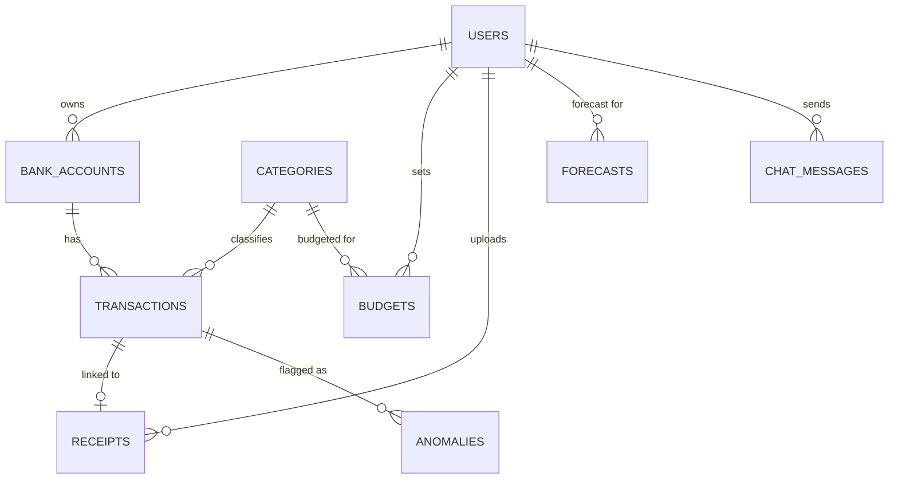

# Entity-Relationship Diagram

**Owner:** Preetkumar Navinbhai Patel (Expense Tracking & OCR / Database & Backend Architecture)
**Status:** Refined from the initial proposal-stage data model. Adds `receipts`, `forecasts`,
`anomalies`, and `chat_messages` tables to support the advanced subsystems, and separates
`bank_accounts` from `users` to support multiple linked accounts per user.

## Notes on refinement since Assessment 1

- The original proposal described the data required only at a high level (user profile,
  transactions, receipts, budget/category metadata). This diagram formalises that into
  concrete tables and foreign-key relationships.
- `bank_accounts` is separated from `users` (1-to-many) so the system can support more
  than one linked sandbox account per user, matching the Open Banking-style scope in the
  proposal.
- `anomalies` references `transactions` directly rather than duplicating transaction data,
  keeping the anomaly-detection subsystem's output lightweight.
- `chat_messages.retrieved_context` stores the retrieved snippets used for a given chatbot
  reply, which supports the RAG design described in `chatbot-savings-design.md`.
